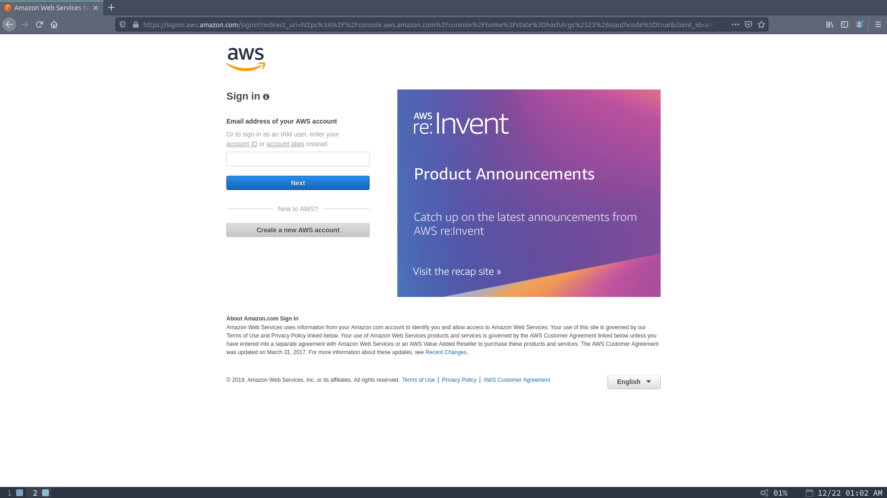
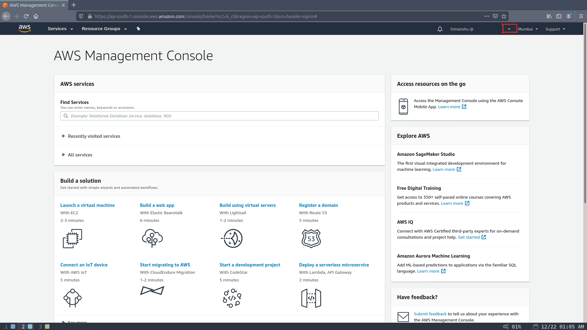
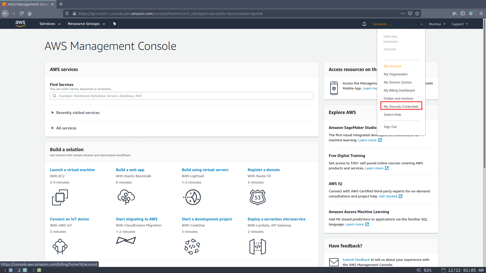
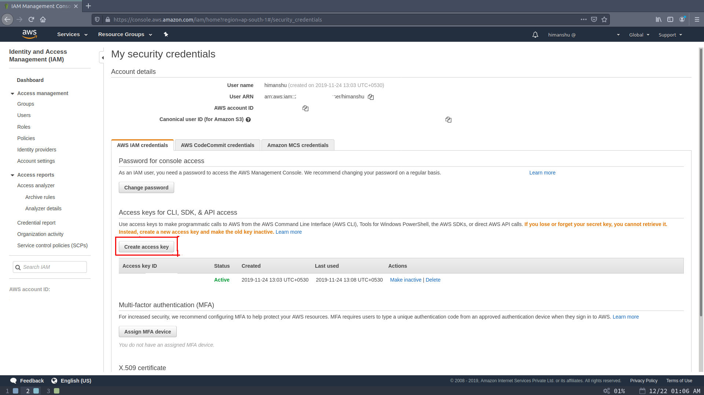

# AWS CLI How-To

This document contains the how to information about `AWS CLI` installation and configurations and usage for various services. For this document the experiments are carried out on an `Ubuntu 18.04 LTS` machine. 

For installing `AWS CLI` on Ubuntu you got options of using `apt` package and `pip` package.

### Installing `AWS CLI` on Ubuntu as `apt` package

- Update your package index 

  ```bash
  $ sudo apt-get update
  ```

- Install `awscli` package

  ```bash
  $ sudo apt-get install -y awscli
  ```

- To verify the installation you can check the version of package installed as

  ```bash
  $ aws --version
  ```

### Installing `AWS CLI`  as `pip` package

`AWS CLI` is a python module so you can also install it with `pip`  ( irrespective of the operating system i.e. the `pip` package also works on Windows ).

- First of all make sure that you have `pip` installed. If not install it using the commands below ( For Ubuntu , For Windows rerun the python setup installer and check the `pip` option in setup. )

  ```bash
  $ sudo apt-get install -y python-pip  # For python 2.x
  $ sudo apt-get install -y python3-pip # For python 3.x
  ```

- Install `awscli` package

  ```bash
  $ sudo -H pip install --upgrade awscli  # For python 2.x at user lvl
  $ sudo -H pip3 install --upgrade awscli # For python 3.x at user lvl
  ```

- To verify the installation you can check the version

   ```bash
  $ aws --version
  aws-cli/1.16.308 Python/3.7.3 Linux/5.0.0-37-generic botocore/1.13.44
  ```

### Configuring  the `AWS CLI`

To use the `AWS CLI` you need to configure it with your AWS account. For doing so you need `Security Credentials` for your account which you can get easily by following steps below: 

- Login in into your account at https://console.aws.amazon.com 

  

- Click on arrow next to you username ( see image below )

  

- From the drop-down menu select `My Security Credentials`

   

- On `My Security Credentilas` page click on `Create access key` button to generate a new access key and save the file.

  


- Now, configure your `AWS CLI` with the access key  you generated 

  ```bash
  $ aws configure
  AWS Access Key ID [None]: XXXXXXXXXXXXXXXXXXXX
  AWS Secret Access Key [None]: XXXXXXXXXXXXXXXXXXXXXXXXXXXXXXXXXXXXXXXX
  Default region name [None]: ap-south-1
  Default output format [None]: json
  ```

  You can select the default region (option in this step but will be required later if you want to do things like managing ec2). I'm using Asia Mumbai as my default region, which is *ap-south-1* and I prefer the output format as `json` which if you select none will be `plain text`.

  