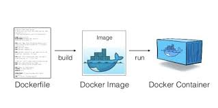

# Get Going with Docker

Hi Folks, we'll be discussing the following topics today

- What the hack is container ?
- Why we need containers ?
- What is Docker ?
- Why and where it is used ?
- Let's play with docker a bit ?

### Container

- **What** - Containers are an abstraction at the app layer that packages code and dependencies together. 

- **Why** - Instead of virtualizing the hardware stack as with the virtual machines                approach, containers virtualize at the operating system level, with multiple containers running atop the OS kernel directly. This means that containers are far more lightweight: they share the OS kernel, start much faster, and use a fraction of the memory compared to booting an entire OS.

- **Benefits** -

  - Quick migration between environments.
  - More manageable.
  - Scalability. 

- **Summary** -

  Containers give developers the ability to create predictable environments            that are isolated from other applications. Containers can also include software            dependencies needed by the application, such as specific versions of programming language runtimes and other software libraries. From the developer’s perspective, all this is guaranteed to be consistent no matter where the application is ultimately deployed.

### Understanding more about containers

Containers can be thought of as necessitating three categories of software:

- Builder: technology used to build a container.

- Engine: technology used to run a container.

- Orchestration: technology used to manage many containers.

  

### Docker 

- **What** - Docker is a set of platform as a service products that uses  OS-level virtualization to deliver software in packages called  containers. Containers are isolated from one another and bundle their  own software, libraries and configuration files; they can communicate  with each other through well-defined channels. 

- **Why** - Docker enables developers to easily pack, ship, and run any application  as a lightweight, portable, self-sufficient container, which can run  virtually anywhere.

  

- **How famous it is?** -   It predictsed "the [application container market will explode over the next five years](https://451research.com/blog/1657-featured-insight). Annual revenue is expected to increase by 4x, growing from $749 million in 2016 to more than $3.4 billion by 2021, representing a compound  annual growth rate (CAGR) of 35 percent."

- **Why I like it?** 

  - Lightweight
  - Robust
  - Scalable
  - Easy to debug
  - No pain of dependencies
  - Reliable

  

  ### Docker Components

  
